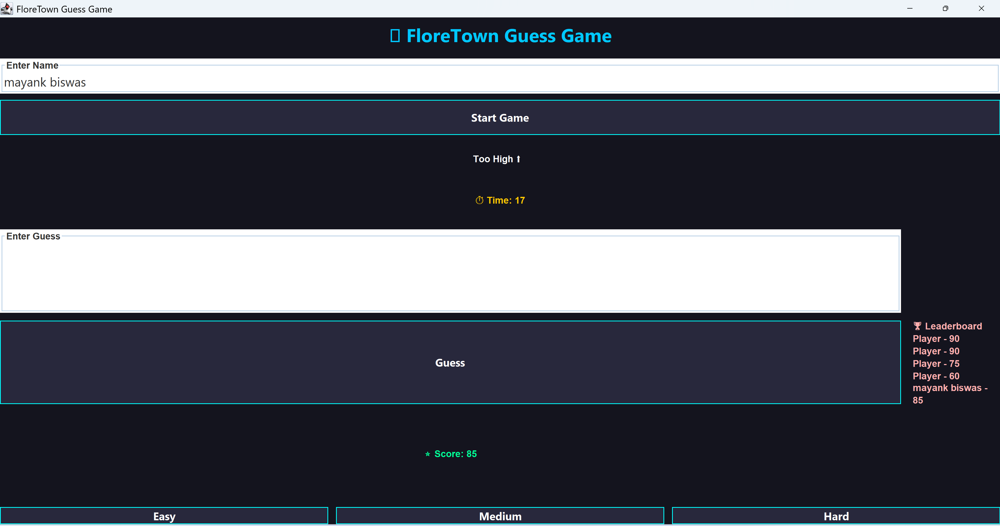

# 🎮 FloreTown Guess Game

A modern Java GUI-based number guessing game built using **Java Swing**, featuring difficulty levels, timer-based gameplay, scoring system, and a persistent leaderboard.

## 🚀 Features

* 🎯 Random number guessing game
* 🧠 Easy / Medium / Hard levels
* ⏱ Countdown timer
* ⭐ Score system
* 🧑 Player name input
* 📊 Leaderboard (saved locally)
* 🔔 Built-in sound feedback
* 🌈 Clean dark-themed UI

## 🛠️ Tech Stack

* Java (Core)
* Java Swing (GUI)
* Event-driven programming
* File handling

## ▶️ Run the Project

```bash
javac FloreTownFinal.java
java FloreTownFinal
```

## 🎮 Gameplay

1. Enter your name
2. Click **Start Game**
3. Choose difficulty
4. Guess the number before time runs out
5. Try to beat the leaderboard!

## 📌 Project Highlights

* Interactive GUI application
* Real-time timer & feedback
* Persistent data storage
* Clean UI design

## 🏆 Built For

FloreTown Event 🚀

---

✨ Demonstrates real-world Java application development

## 📸 Preview


## 👨‍💻 Author
Mayank Biswas

## 🎥 Demo
👉 https://youtu.be/32nmWzdVQOY
